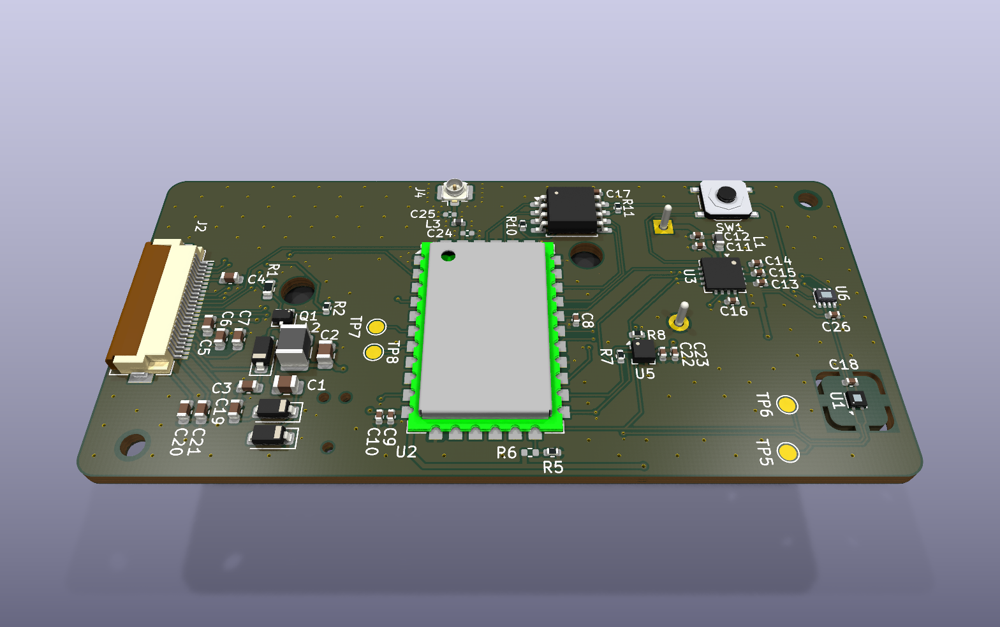
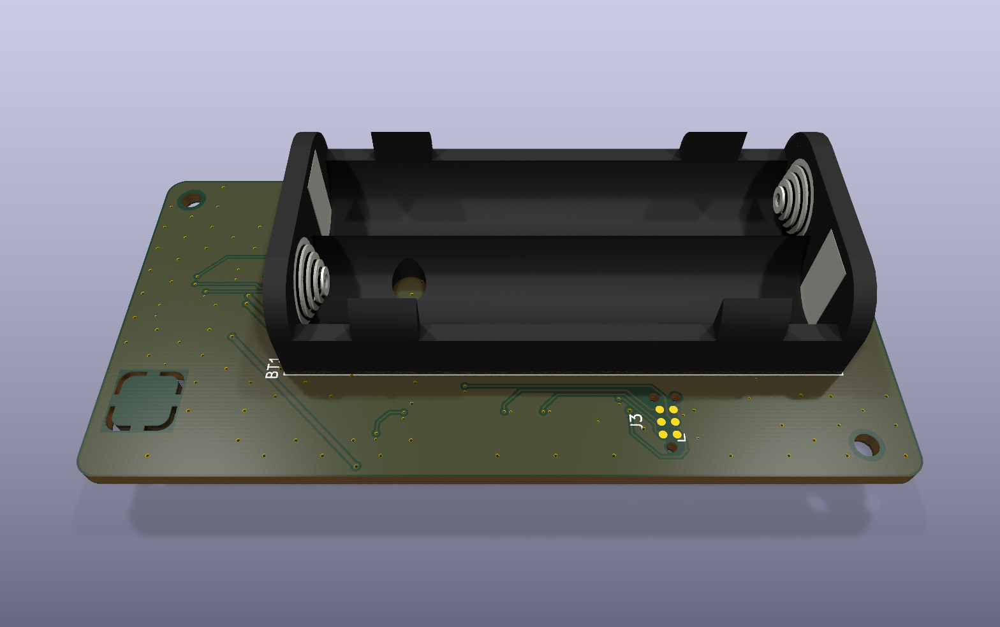

> [!IMPORTANT]
> This project is a work in progress. The board is routed and passes DRC but has not been fabricated or tested yet.

# LoRaWAN AirRH

A slim, battery-powered LoRaWAN sensor node for monitoring temperature and humidity in warehouses, cold storage, greenhouses and FMCG storage. Readings are shown on an e-ink display, logged to onboard flash and sent to a LoRaWAN gateway. It runs on two AAA cells and needs no app, Wi-Fi or cloud account.

This repository holds **SKU A (Environmental)**. A mains-powered air-quality variant (SKU B) is planned as a separate board. See [PLAN.md](PLAN.md).



*Top: RAK811 LoRa module, nPM2100 PMIC, sensors, e-ink FPC connector and display booster.*



*Bottom: 2×AAA holder, Tag-Connect SWD pads, and the thermally isolated SHT45 island (top right in the top view).*

## Features

| | |
|---|---|
| **Radio** | LoRaWAN (OTAA) via RAK811 module (STM32L1 + SX1276), EU868, U.FL antenna connector |
| **Temperature / humidity** | Sensirion SHT45 on a slotted, copper-free island to keep board heat off the sensor |
| **Light** | TI OPT3004, 23-bit ambient light with threshold interrupt (door-open / light-exposure logging) |
| **Motion** | ST LIS2DW12, ultra-low-power accelerometer for shock and tilt detection |
| **Display** | 2.13" GDEY0213B74 e-ink panel. It is bistable, so it keeps showing the last reading with no power |
| **Logging** | Winbond W25Q16JV, 16 Mbit SPI flash |
| **Power** | 2×AAA alkaline into a Nordic nPM2100 boost PMIC (0.7–3.4 V input), with a ship/wake button |
| **Debug** | Tag-Connect TC2030 SWD (no header), UART test points |
| **Enclosure target** | IP54 |
| **Operating range** | 0 to +50 °C. The limit comes from the e-ink panel; all other parts are rated to −40 °C |

## Hardware

| Ref | Part | Function |
|---|---|---|
| U2 | RAK811-HF-EU868 | LoRaWAN module and application MCU |
| U3 | nPM2100-QEAA | Boost PMIC, battery fuel gauge, ship mode |
| U1 | SHT45-AD1B | Temperature and humidity |
| U6 | OPT3004DTSR | Ambient light |
| U5 | LIS2DW12TR | Accelerometer |
| U4 | W25Q16JVSS | Data-logging flash |
| J2 | Hirose FH12-24S-0.5SH | 24-pin FPC connector for the e-ink panel |
| J4 | Hirose U.FL-R-SMT-1 | Antenna connector |
| BT1 | Keystone 2468 | 2×AAA battery holder |
| J3 | Tag-Connect TC2030-IDC-NL | SWD programming |

**Buses**
- **I2C1**: SHT45 (0x44), OPT3004 (0x45), LIS2DW12 (0x19), nPM2100, with 4.7 k pull-ups.
- **SPI**: bit-banged SCK/MOSI shared between the display and flash, with separate chip selects. The RAK811 has no free hardware SPI.

## PCB

- 36 × 75.2 mm, 4 layers, 1.6 mm, ENIG, built to JLCPCB standard 4-layer rules (JLC04161H-7628).
- Stackup is signal / GND / GND / signal. Power is routed as traces, and both inner layers are solid ground.
- 50 Ω grounded coplanar waveguide from the RAK811 to the U.FL: 0.371 mm track with a 0.2 mm gap over In1 GND, fenced with ground vias. A pi-match footprint is included (fitted as 0 Ω, capacitors not populated).
- Hexagonal GND stitching-via grid across the board.
- Custom design rules are in [`lorawan-airrh.kicad_dru`](lorawan-airrh/lorawan-airrh.kicad_dru): JLC via and drill limits, the RF track, and clearance for the ±20 V display rails.

## Firmware notes

The board depends on firmware for these:

1. **Raise the supply before the first LoRa transmission.** VSET is left open, so the nPM2100 starts at 3.0 V. The RAK811 needs 3.15–3.45 V, so write `BOOST.VOUT` = 3.3 V over I2C first.
2. **Enable the MCU's internal pull-up on `LIGHT_INT`.** The OPT3004 interrupt output is open-drain and has no external pull-up.
3. **Skip display refreshes below 0 °C** (use the SHT45 reading). The panel is only rated to refresh from 0 to +50 °C, and the last image stays visible anyway.
4. Keep the LIS2DW12 CS and SA0 pins high. They are tied high on the board; driving either low draws about 160 µA through the internal pull-ups.

## Repository layout

```
lorawan-airrh/          KiCad 10 project (schematic, PCB, local symbols/footprints/3D models)
Datasheets/             Datasheets for the main parts
images/                 Board renders
Abstract.md             Product concept and market notes
Design Requirements.md  Requirements for this model
PLAN.md                 Engineering plan, design decisions and status log
```

## Status

- [x] Schematic, ERC clean
- [x] Placement and routing, DRC clean, no schematic mismatches
- [ ] BOM with MPN / LCSC part numbers
- [ ] Confirm the e-ink FPC contact side against a panel sample
- [ ] Fabrication outputs (Gerbers, drill, pick-and-place)
- [ ] Bring-up and firmware

## License

[GPL-3.0](LICENSE)
